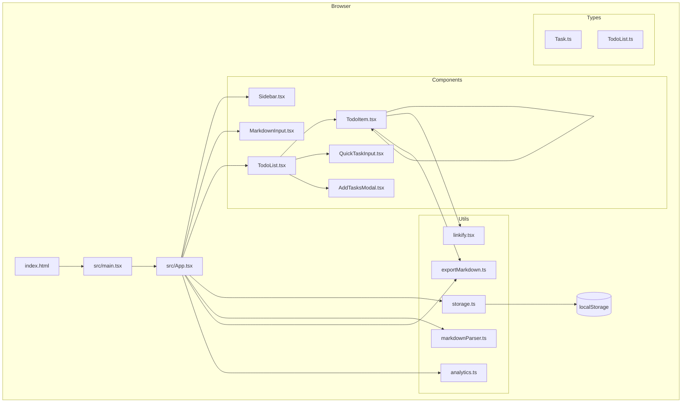

# TL;DR

Markdown Todo List is a client-side React application that transforms markdown content into interactive, hierarchical todo lists. Users can paste markdown text with headers and bullet points, and the app automatically converts it into a structured, checkable task list with drag-and-drop reordering, collapsible sections, and real-time bidirectional sync between markdown and the task UI.

The application supports multiple todo lists with a sidebar for navigation, persistent localStorage storage with debounced saves, inline editing, task search/filtering, and the ability to hide completed tasks. Typical user flows include: importing/pasting markdown, checking off tasks (with cascading completion for children), reordering tasks via drag-and-drop, exporting lists back to markdown, and managing multiple named lists.

**Non-goals:** Backend synchronization, multi-device sync, collaborative editing, authentication, rich text rendering within tasks, or persistent server-side storage.

## Capabilities

- **Multi-List Management (src/App.tsx, src/components/Sidebar.tsx)**
  Create, switch between, rename, and delete multiple independent todo lists. Lists are sorted by last-updated timestamp and each maintains its own task hierarchy and markdown state. See: `src/IMPLEMENTATION.md`

- **Markdown-to-Tasks Conversion (src/utils/markdownParser.ts)**
  Parses markdown headers (`###` to `######`) into collapsible sections and bullet points (`*`, `-`, `+`) with optional checkboxes (`[ ]`, `[x]`) into hierarchical tasks. Supports arbitrary nesting via 2-space indentation. Bidirectional sync keeps markdown and UI in lockstep.

- **Task Operations (src/components/TodoList.tsx, src/components/TodoItem.tsx)**
  Toggle completion (cascades to children), inline editing with Enter/Escape shortcuts, add subtasks, delete tasks, drag-and-drop reordering with visual indicators, collapse/expand sections, undo stack (20 actions), search filtering, and hide-completed toggle.

- **Data Export (src/utils/exportMarkdown.ts)**
  Convert current task hierarchy back to markdown. Copy to clipboard or download as `.md` file. Each task/section can also be copied individually.

- **Persistence (src/utils/storage.ts)**
  All state persists to localStorage under key `markdown-todo-app-state`. Debounced writes (300ms) prevent excessive I/O. Graceful handling of quota errors.

- **Analytics (src/utils/analytics.ts)**
  Optional Google Analytics integration via `VITE_GA_MEASUREMENT_ID` environment variable. Tracks task operations, list management, UI interactions, and data export events.

## Tech Stack & Versions

| Layer | Technology |
|-------|-----------|
| Runtime | Node.js 18+ (build), Browser (runtime) |
| Framework | React 19.1 |
| Build | Vite 7.1 |
| Language | TypeScript 5.9 |
| Styling | styled-components 6.1 |
| Package Manager | pnpm |
| Container | Docker (nginx:alpine) |
| Linting | ESLint 9 (flat config) |

## Repo Topology & Boundaries

| Component/Domain | Path Globs |
|------------------|------------|
| Application Core | `src/App.tsx`, `src/main.tsx` |
| UI Components | `src/components/**` |
| Type Definitions | `src/types/**` |
| Utilities | `src/utils/**` |
| Styles | `src/index.css` |
| Static Assets | `public/**` |
| Container Config | `Dockerfile`, `.dockerignore` |
| Cloud Build | `cloudbuild.yaml`, `CLOUD_RUN_DEPLOYMENT.md` |
| Config | `vite.config.ts`, `tsconfig*.json`, `eslint.config.js` |

> Component implementation details: `src/IMPLEMENTATION.md`

## Interfaces

- **HTTP API:** None (client-side only)
- **GraphQL:** None
- **gRPC:** None
- **Events:** Browser `localStorage` events (implicit)
- **CLI:** None
- **External Services:** Google Analytics (optional)

## Architecture



See also: `src/IMPLEMENTATION.md`

## Data Model (high level)

- **TodoList** — id, name, tasks[], markdown string, isMinimized flag, createdAt/updatedAt timestamps
- **Task** — id, text, completed boolean, level (nesting depth), optional isHeader flag, recursive children[]
- **StorageData** — lists map (listId → TodoList), currentListId pointer
- **localStorage key** — `markdown-todo-app-state`
- **Relationships** — Tasks form a tree via `children[]`; TodoLists are flat siblings keyed by UUID

## Runtime & Operations

- **Environments:** Local dev (`pnpm dev`), Production (static build via `pnpm build`)
- **Deployment:** Docker container (nginx on port 8080) or any static host
- **Build Output:** `dist/` directory with hashed assets
- **Observability:**
  - Google Analytics events (when configured)
  - Browser DevTools for localStorage inspection
- **SLOs/Alerts:** N/A (client-side app)

## Security & Compliance

- **AuthN/Z:** None (single-user, browser-local)
- **PII:** User-generated task text stored in localStorage only; not transmitted
- **Secrets:** `VITE_GA_MEASUREMENT_ID` build-time env var (non-sensitive tracking ID)
- **CORS:** N/A (no external API calls except GA beacon)

## Development Workflow (fast path)

```bash
# Bootstrap
pnpm install

# Run dev server
pnpm dev

# Lint & typecheck
pnpm lint

# Build for production
pnpm build

# Preview production build
pnpm preview

# Docker build
docker build -t todo-list .

# Docker run
docker run -p 8080:8080 todo-list
```

## Decision Index

| Decision | Summary |
|----------|---------|
| Client-only architecture | No backend needed; localStorage suffices for single-user task management |
| Bidirectional markdown sync | Guard flags (`isUpdatingFromMarkdown`, `isUpdatingFromTasks`) prevent infinite loops |
| Recursive task rendering | Arbitrary nesting depth via recursive `TodoItem` component |
| Debounced persistence | 300ms debounce on localStorage writes and markdown parsing |
| styled-components | CSS-in-JS for component-scoped styling without class name collisions |
| Vite + React | Modern build tooling with fast HMR and optimized production builds |

## Context Selection Hints (for AI)

- Start with `src/IMPLEMENTATION.md` for implementation details before diving into source files
- The main state management is in `src/App.tsx` — read this first for understanding data flow
- `src/utils/markdownParser.ts` and `src/utils/exportMarkdown.ts` are the core transform logic
- Avoid reading `node_modules/`, `dist/`, and `pnpm-lock.yaml`
- For UI changes, check the relevant component in `src/components/` and its styled-components
- Task hierarchy uses recursive patterns — trace `children[]` for nesting behavior
