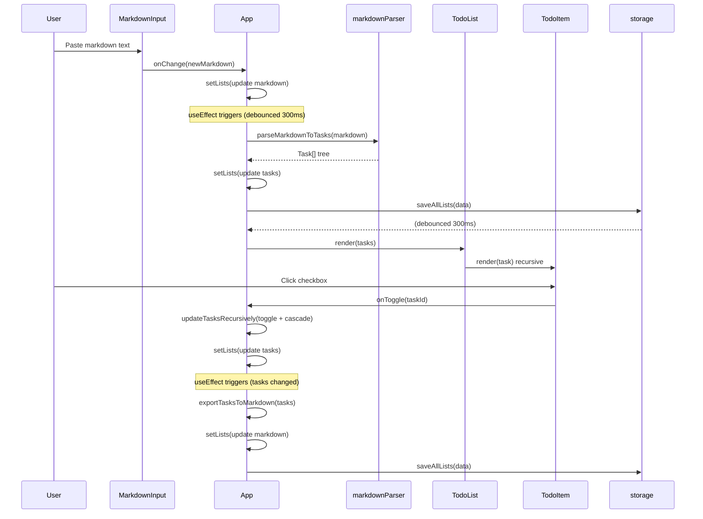

# Purpose & Responsibilities

This application provides a browser-based markdown-to-todo-list converter with full CRUD operations on hierarchical tasks. It owns all client-side state management, markdown parsing/serialization, drag-and-drop task reordering, and localStorage persistence. The core value proposition is enabling users to rapidly convert markdown notes into interactive, checkable task lists without server dependencies.

Key quality attributes: immediate responsiveness (all operations are local), data durability via localStorage, and bidirectional sync that keeps markdown text and task UI representations consistent. The application supports arbitrary task nesting, section headers, multi-list management, and optional Google Analytics tracking for product insights.

**Non-goals:** Server-side persistence, authentication, collaborative editing, markdown rendering (bold/italic/links in task text body), recurring tasks, due dates, or notifications.

## Public Interfaces

### Entry Points
- **`main.tsx:6`** — React root render, bootstraps `<App />` in StrictMode
- **`index.html`** — HTML shell with Google Analytics loader (conditional)

### State Handlers (App.tsx)
| Handler | Purpose |
|---------|---------|
| `handleCreateList` | Creates new TodoList with UUID, adds to state |
| `handleSwitchList` | Changes `currentListId` to selected list |
| `handleDeleteList` | Removes list, switches to another or creates default |
| `handleListNameChange` | Updates list name |
| `handleMarkdownChange` | Updates markdown string, triggers parse |
| `handleToggleMinimize` | Collapses/expands markdown input area |
| `handleToggle` | Toggles task completion (cascades to children) |
| `handleUpdate` | Updates task text inline |
| `handleDelete` | Removes task and all descendants |
| `handleAddSubtask` | Adds child task under parent |
| `handleAddRootTask` | Adds task at root level |
| `handleAddSection` | Adds header section at root |
| `handleMoveTask` | Drag-drop reposition (before/after/inside) |
| `handleUndo` | Restores previous task state from history |
| `handleExport` | Copies markdown to clipboard |
| `handleDownload` | Downloads markdown as `.md` file |
| `handleImportMarkdown` | Reads `.md`/`.txt` file into markdown state |
| `handleAddTasksFromMarkdown` | Merges parsed tasks into existing list |
| `handleQuickAddTask` | Adds single task from quick input |

### Utility Functions
- **`parseMarkdownToTasks(markdown)`** — Converts markdown string to `Task[]` tree
- **`mergeTasks(existing, new, parentId?)`** — Merges new tasks into existing hierarchy
- **`exportTasksToMarkdown(tasks)`** — Converts `Task[]` back to markdown string
- **`exportSingleTaskToMarkdown(task)`** — Exports one task subtree
- **`loadAllLists()` / `saveAllLists(data)`** — localStorage CRUD
- **`createNewList(name)`** — Factory for new TodoList
- **`linkifyText(text)`** — Converts URLs and `[text](url)` to React anchor elements

## Invariants & Rules

### Bidirectional Sync Guards
- **`isUpdatingFromMarkdown` ref** — Set when markdown parse triggers task update; prevents task→markdown→task loop
- **`isUpdatingFromTasks` ref** — Set when task change triggers markdown regeneration; prevents markdown→task→markdown loop

### Data Consistency
- **Task IDs** — Generated via `crypto.randomUUID()`, globally unique per session
- **Task levels** — Integer >= 0; headers are level 0+, child tasks are `parent.level + 1`
- **Cascading completion** — Toggling a task's `completed` state applies to all descendants
- **Undo history** — Stores last 20 task snapshots; undo restores full task array

### Markdown Parsing Rules
- Headers: `#{1,6} text` → `isHeader: true`, level = max(0, headerDepth - 3)
- Bullets: `* | - | +` with 2-space indentation per level
- Checkboxes: `[ ]` = uncompleted, `[x]` = completed
- Empty lines and `---` are skipped

### Persistence
- **Debounce:** 300ms on localStorage writes and markdown parsing
- **Storage key:** `markdown-todo-app-state`
- **Quota handling:** Alerts user on `QuotaExceededError`

### Validation
- Import file types: `.md`, `.txt` only
- Import file size: max 1MB
- Task text: trimmed, never empty after edit

## Where Things Live

| Role | Path |
|------|------|
| Application shell & state | `App.tsx` |
| React bootstrap | `main.tsx` |
| Global styles | `index.css` |
| Multi-list sidebar | `components/Sidebar.tsx` |
| Markdown input area | `components/MarkdownInput.tsx` |
| Task list container | `components/TodoList.tsx` |
| Individual task (recursive) | `components/TodoItem.tsx` |
| Quick task input | `components/QuickTaskInput.tsx` |
| Bulk add modal | `components/AddTasksModal.tsx` |
| Task type definition | `types/Task.ts` |
| List type definition | `types/TodoList.ts` |
| Markdown → Tasks parser | `utils/markdownParser.ts` |
| Tasks → Markdown exporter | `utils/exportMarkdown.ts` |
| localStorage operations | `utils/storage.ts` |
| Google Analytics events | `utils/analytics.ts` |
| URL linkification | `utils/linkify.tsx` |

## Control Flow (core: markdown paste to task toggle)



## Data & State

### Task Type (`types/Task.ts`)
```typescript
type Task = {
  id: string;           // UUID
  text: string;         // Display text
  completed: boolean;   // Completion status
  level: number;        // Nesting depth (0 = root)
  isHeader?: boolean;   // Section header (non-checkable)
  children?: Task[];    // Nested subtasks
};
```

### TodoList Type (`types/TodoList.ts`)
```typescript
type TodoList = {
  id: string;
  name: string;
  tasks: Task[];
  markdown: string;
  isMinimized: boolean;
  createdAt: number;
  updatedAt: number;
};

type StorageData = {
  lists: { [listId: string]: TodoList };
  currentListId: string | null;
};
```

### localStorage Schema
- Key: `markdown-todo-app-state`
- Value: JSON-serialized `StorageData`
- No migrations; schema is stable

### Caching
- In-memory React state is source of truth during session
- localStorage is persistence layer, written on debounce
- No external caches (Redis, CDN, etc.)

## Configuration & Flags

| Variable | Purpose | Default |
|----------|---------|---------|
| `VITE_GA_MEASUREMENT_ID` | Google Analytics tracking ID | None (disabled) |

**Feature Flags:** None currently implemented.

**Build-time Configuration:**
- `vite.config.ts` — Vite plugins (React)
- `tsconfig.json` / `tsconfig.app.json` — TypeScript compiler options
- `eslint.config.js` — ESLint flat config with React hooks plugin

## Dependencies

### Internal
None (single application, no internal package dependencies)

### External

| Dependency | Purpose | Failure Mode |
|------------|---------|--------------|
| `localStorage` | State persistence | Falls back to in-memory only; warns user on quota errors |
| Google Analytics | Usage tracking | Silent no-op if `VITE_GA_MEASUREMENT_ID` not set |
| Browser Clipboard API | Copy to clipboard | Falls back to `execCommand('copy')` for older browsers |

### NPM Dependencies
- `react`, `react-dom` — UI framework
- `styled-components` — CSS-in-JS styling
- `vite`, `@vitejs/plugin-react` — Build tooling
- `typescript`, `typescript-eslint` — Type checking and linting

## Observability & Failure Modes

### Analytics Events (when GA enabled)
- Task operations: `task_created`, `task_completed`, `task_uncompleted`, `task_updated`, `task_deleted`, `subtask_added`, `section_added`, `task_moved`
- List operations: `list_created`, `list_switched`, `list_deleted`, `list_renamed`
- Data operations: `markdown_exported`, `markdown_downloaded`, `markdown_imported`, `undo_action`, `bulk_tasks_added`
- UI interactions: `editor_toggled`, `hide_completed_toggled`, `search_used`

### Error Handling
- **localStorage quota:** Alert user, operation fails silently
- **File read error:** Alert user with error message
- **Invalid file type/size:** Alert user, reject import
- **Clipboard write fail:** Fall back to legacy `execCommand`, alert on complete failure

### Debugging
- Console logs for checkbox interactions (development artifacts in TodoItem)
- React DevTools for component state inspection
- Application tab in DevTools for localStorage inspection

## Performance & Limits

### Targets
- Markdown parse: <100ms for typical documents (<1000 lines)
- Task toggle: immediate (< 16ms for single task)
- localStorage write: debounced, non-blocking

### Hot Paths
- `updateTasksRecursively` — Called on every task mutation; O(n) tree traversal
- `filterTasksBySearch` — Called on every render when search active; O(n) recursive filter
- `countTasks` — Called in Sidebar and TodoList; O(n) traversal

### Known Limits
- localStorage: ~5-10MB browser limit
- Undo history: capped at 20 states to prevent memory bloat
- Deep nesting: no hard limit, but UI becomes cramped beyond ~6 levels

## How to Change This

### Add a new task property (e.g., due date)

1. **Update type:** `types/Task.ts` — add optional field
2. **Update parser:** `utils/markdownParser.ts` — parse new syntax (if markdown-based)
3. **Update exporter:** `utils/exportMarkdown.ts` — serialize new field
4. **Update UI:** `components/TodoItem.tsx` — display/edit new field
5. **Update handlers:** `App.tsx` — add mutation handler if needed
6. **Test manually:** Create tasks with new field, verify round-trip through markdown

### Add a new analytics event

1. **Add tracker function:** `utils/analytics.ts` — follow existing pattern
2. **Call tracker:** Import and invoke in appropriate handler in `App.tsx` or component
3. **Verify:** Check GA real-time view with dev build

### Add a new component

1. **Create file:** `components/NewComponent.tsx`
2. **Define styled components:** Use styled-components for styling
3. **Define props interface:** TypeScript interface for props
4. **Export component:** Named export preferred
5. **Import in parent:** Add to App.tsx or parent component
6. **Wire up handlers:** Pass callbacks from App state if needed

### Modify localStorage schema

1. **Update types:** `types/TodoList.ts` if adding fields to TodoList or StorageData
2. **Update storage utils:** `utils/storage.ts` — consider migration logic for existing data
3. **Update App initialization:** `App.tsx` `useEffect` on mount may need migration handling

## Testing

Currently no automated tests are configured.

**Recommended test locations:**
- `tests/unit/` — Unit tests for parsers, exporters, storage utils
- `tests/components/` — Component tests with React Testing Library
- `tests/e2e/` — End-to-end tests with Playwright or Cypress

**Manual testing checklist:**
- Create list, add tasks, verify localStorage persistence
- Import `.md` file, verify parse
- Toggle tasks, verify cascade to children
- Drag-drop reorder, verify undo
- Search filter, verify partial matches
- Hide completed, verify filtering
- Export to clipboard/download, verify markdown output

## Security

### Validation Hotspots
- **File import:** Validates extension (`.md`, `.txt`) and size (<1MB) in `MarkdownInput.tsx` and `AddTasksModal.tsx`
- **User input:** Task text stored as-is; rendered via React (XSS-safe by default)
- **URL linkification:** Uses `<a target="_blank" rel="noopener noreferrer">` for external links

### Data Flow
- All data stays client-side in localStorage
- No server communication except optional GA beacons
- No authentication or authorization (single-user model)

### PII Considerations
- Task text may contain user-sensitive information
- Stored only in browser localStorage (not transmitted)
- User responsible for not entering secrets in tasks

## Related Links

- **README.md** — User-facing documentation with usage examples
- **CLOUD_RUN_DEPLOYMENT.md** — Google Cloud Run deployment guide
- **Dockerfile** — Container build configuration
- **cloudbuild.yaml** — Google Cloud Build configuration
